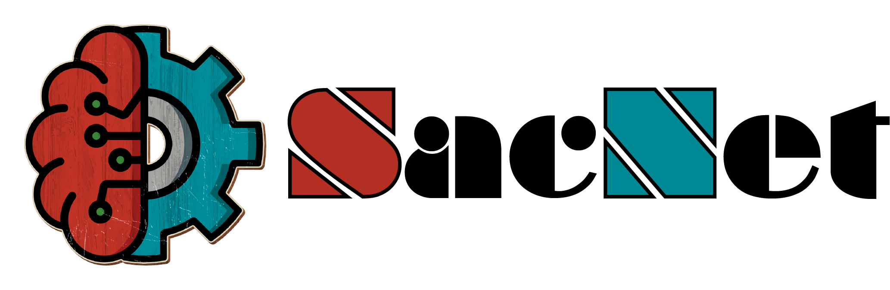
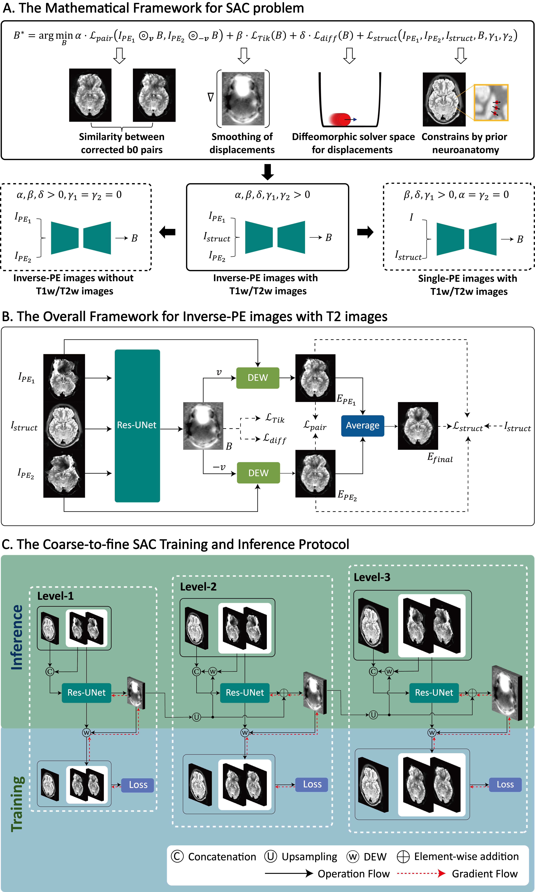

<div align="center">
  
</div>


[](LICENSE)

 

<!-- []() -->

# **SACNet: Learning-Based Susceptibility Artifact Correction**

<!-- This repository provides the official implementation of our paper "**SACNet**: <u>**M**</u>ult<u>**i**</u>scale <u>**N**</u>euroanatomy-prior <u>**D**</u>iffeomorphic <u>**S**</u>usce<u>**p**</u>tibility <u>**A**</u>rtifact <u>**C**</u>orrection N<u>**e**</u>twork with  for Multicentre Echo Planar Imaging". **If you are using *SACNet* for your research, please cite our paper!** -->

This repository provides the official implementation of our paper "SACNet: A Multiscale Diffeomorphic Convolutional Registration Network with Prior Neuroanatomical Constraints for Flexible Susceptibility Artifact Correction in Echo Planar Imaging". **If you are using *SACNet* for your research, please cite our paper!**

Created by Zilong Zeng at State Key Laboratory of Cognitive Neuroscience and Learning, Beijing Normal University. **For any questions, please contact Zilong Zeng (zilongzeng@mail.bnu.edu.cn) or Dr.Zhao (tengdazhao@bnu.edu.cn).**


# **Contents**
- [**SACNet: Learning-Based Susceptibility Artifact Correction**](#sacnet-learning-based-susceptibility-artifact-correction)
- [**Contents**](#contents)
- [**1. Background**](#1-background)
- [**2. Local Installation**](#2-local-installation)
  - [**2.1. Installation**](#21-installation)
    - [**2.1.1. Python packages installation**](#211-python-packages-installation)
    - [**2.1.2. FSL installation**](#212-fsl-installation)
    - [**2.1.3. Environment variables setup**](#213-environment-variables-setup)
  - [**2.2. Usage**](#22-usage)
    - [**2.2.1. Preprocess**](#221-preprocess)
    - [**2.2.2. Training**](#222-training)
    - [**2.2.3. Only correct susceptibility artifact**](#223-only-correct-susceptibility-artifact)
      - [**2.2.3.1. Use our pretrained model**](#2231-use-our-pretrained-model)
      - [**2.2.3.2. Use your own model**](#2232-use-your-own-model)
    - [**2.2.4. Runing pipeline for simultaneously correcting susceptibility and eddy current-induced artifacts**](#224-runing-pipeline-for-simultaneously-correcting-susceptibility-and-eddy-current-induced-artifacts)
      - [**2.2.4.1. Use our pretrained model**](#2241-use-our-pretrained-model)
      - [**2.2.4.2. Use your own model**](#2242-use-your-own-model)
- [**3. Docker Image Installation**](#3-docker-image-installation)
  - [**3.1. System requirement**](#31-system-requirement)
  - [**3.2. Installation**](#32-installation)
    - [**3.2.1. Install Docker**](#321-install-docker)
    - [**3.2.2. Install Nvidia-docker**](#322-install-nvidia-docker)
    - [**3.2.3. Install docker image of SACNet**](#323-install-docker-image-of-sacnet)
  - [**3.3. Usage**](#33-usage)
- [**4. Some other information**](#4-some-other-information)

# **1. Background**
Susceptibility artifacts (SAs), which are inevitable for modern diffusion brain MR images with single-shot echo planar imaging (EPI) protocols in wide large-scale neuroimaging datasets,  severely hamper the accurate detection of the human brain white matter structure. While several conventional and deep-learning based distortion correction methods have been proposed, the correction quality and model generality of these approaches are still limited. Here, we proposed the SACNet, a flexible SAs correction (SAC) framework for brain diffusion MR images of various phase-encoding EPI protocols based on an unsupervised learning-based registration convolutional neural network. This method could generate smooth diffeomorphic warps with optional neuroanatomy guidance to correct both geometric and intensity distortions of SAs. By employing multicenter brain scans covering neonatal, child, adult and traveling participants, our SACNet consistently demonstrates state-of-the-art correction performance and effectively eliminates SAs-related multicenter effects compared with existing SAC methods. To facilitate the development of standard SAC tools for future neuroimaging studies, we also created easy-to-use command lines incorporating containerization techniques for quick user deployment.



# **2. Local Installation**

## **2.1. Installation**
### **2.1.1. Python packages installation**
Please run the following commands for installing related python packages:
  ```bash
  pip install art==5.3 nibabel==3.2.1 matplotlib==3.3.4 batchgenerators==0.23 torch==1.9.1
  ```
Then install SACNet:
  ```bash
  git clone https://github.com/RicardoZiTseng/SACNet.git
  cd SACNet
  pip install -e .
  ```
Once you successfully install SACNet, you can run the following command:

```bash
sacnet_show_avaliable_model_info
```
Then all the pretrained models' information will be display.

### **2.1.2. FSL installation**
Please visit the [FSL](https://fsl.fmrib.ox.ac.uk/fsl/fslwiki/) website.

### **2.1.3. Environment variables setup**
There are two environmental variables need to set: `SACNetScriptDir` and `SACNet_RESULTS_FOLDER`.

`SACNetScriptDir` represents the path to the pipeline codes of SACNet, and `SACNet_RESULTS_FOLDER` represents the folder location where the user saved the trained model. Suppose that the path to SACNet's source code is `/my_own_folder/SACNet`, and your own folder used to store your model is `/my_own_folder_to_store`, then you need to run `vim ~/.bashrc` and edit the following commands in `~/.bashrc`:
```bash
export SACNetScriptDir=/my_own_folder/SACNet/pipeline
export SACNet_RESULTS_FOLDER=/my_own_folder_to_store
PATH=${SACNetScriptDir}:${PATH}
```
Once you successfully install SACNet, you can run the following command:
```bash
sacnet_pipeline_multipe.sh --help
```
Then all the usage information of `sacnet_pipeline_multipe.sh` will be displayed.

**Notice: an alternative way of setting these paths!!**

The method above sets the paths permanently (until you delete the lines from your .bashrc) on your system. If you wish to set them only temporarily, you can directly run the export commands in your terminal:
```bash
export SACNetScriptDir=/my_own_folder/SACNet/pipeline
export SACNet_RESULTS_FOLDER=/my_own_folder_to_store
```
This will set the paths for the current terminal session only (the variables will be lost if you close the terminal and need to be reset every time).

## **2.2. Usage**
### **2.2.1. Preprocess**

We adopted the HCP-pipelines to preprocess T1w/T2w images in our paper. Thus if you want to use our pretrained model, we recommend you to use HCP-pipelines to preprocess your own data to achieve best results.

### **2.2.2. Training**

*Notice: The tutorial document of training process will be updated recently.*

You need two files for training SACNet:
- One is the training configuration file `train_config.json`, which contains the hyper-parameters for the network training.
- The other one is the dataset file `data_config.json`, which describe the information of dataset used for training and validation.

Once these two files have been prepared, runing the following command:
```bash
sacnet_train -t train_config.json -d data_config.json
```

### **2.2.3. Only correct susceptibility artifact**
#### **2.2.3.1. Use our pretrained model**
- If you want to directly use our pretrained model for the multi-PE type data (suppose the phase encoding direction is LR-RL) with neuroantomy information (suppose it's T1w image), please run the following command:
  ```bash
  sacnet_predict_multipe.sh --pos_b0=Pos.nii.gz --neg_b0=Neg.nii.gz \
                            --t1=T1w.nii.gz --direction=x --gpu_id=0 \
                            --out=sacnet_output --no_intensity_correction=0 \
                            --pretrained_model_name_by_developers=HCP_MultiPEWithT1w_LRRL \
  ```
  This program will output 5 files with prefix of the value specified in option `--out`, in this situation it's `sacnet_output`. The following explain what the results are:
  - sacnet_output_corrected.nii.gz: The geometric average of `sacnet_output_corrected_pos.nii.gz` and `sacnet_output_corrected_neg.nii.gz`.
  - sacnet_output_corrected_pos.nii.gz: The b0 file (positive PE direction) which has corrected the susceptibility artifact.
  - sacnet_output_corrected_neg.nii.gz: The b0 file (negative PE direction) which has corrected the susceptibility artifact.
  - sacnet_output_fieldmap.nii.gz: The fiedmap used to correct susceptibility artifact.
  - sacnet_neg2pos_movmat.txt: The rigidly registration matrix (dof=6) from original negative b0 image to positive b0 image, which indicates the head movement between original positive and negative b0 images.

  For detailed usage of script `sacnet_predict_multipe.sh`, please run the following command:
  ```bash
  sacnet_predict_multipe.sh --help
  ```

- If you want to directly use our pretrained model for the single-PE type data (suppose the phase encoding direction is AP) with neuroantomy information (suppose it's T1w image), please run the following command:
  ```bash
  sacnet_predict_singlepe.sh --b0=Diff.nii.gz --t1=T1w.nii.gz \
                             --direction=y --gpu_id=0 --out=sacnet_output \
                             --no_intensity_correction=1 \
                             --pretrained_model_name_by_developers=CBD_SinglePEWithT1w_AP
  ```
  This program will output 2 files with prefix of the value specified in option `--out`, in this situation it's `sacnet_output`. The following explain what the 
  results are:
  - sacnet_output_corrected.nii.gz: The b0 image which has corrected susceptibility artifact.
  - sacnet_output_fieldmap.nii.gz: The fiedmap used to correct susceptibility artifact.

  For detailed usage of script `sacnet_predict_singlepe.sh`, please run the following command:
  ```bash
  sacnet_predict_singlepe.sh --help
  ```

#### **2.2.3.2. Use your own model**
- If you want to use your trained model for the multi-PE type data with neuroantomy information (suppose it's T1w image), please run the following command:
  ```bash
  sacnet_predict_multipe.sh --pos_b0=Pos.nii.gz --neg_b0=Neg.nii.gz \
                          --t1=T1w.nii.gz --direction=x --gpu_id=0 \
                          --out=sacnet_output --no_intensity_correction=0 \
                          --pretrained_model_name_by_users=MyMultiPEModelWithT1w \
  ```

- If you want to use your trained model for the single-PE type data with neuroantomy information (suppose it's T1w image), please run the following command:
  ```bash
  sacnet_predict_singlepe.sh --b0=Diff.nii.gz --t1=T1w.nii.gz \
                            --direction=y --gpu_id=0 --out=sacnet_output \
                            --no_intensity_correction=1 \
                            --pretrained_model_name_by_users=MySinglePEWithT1w_AP
  ```

### **2.2.4. Runing pipeline for simultaneously correcting susceptibility and eddy current-induced artifacts**
If you want to remove both susceptibility and eddy current-induced artifacts, please following these steps.
#### **2.2.4.1. Use our pretrained model**
- If you want to directly use our pretrained model for the multi-PE type data (suppose the phase encoding direction is LR-RL) with neuroantomy information (suppose it's T1w image), please run the following command:
  ```bash
  sacnet_pipeline_multipe.sh --pos_vols=Pos.nii.gz --pos_bvecs=Pos.bvec --pos_bvals=Pos.bval \
  --neg_vols=Neg.nii.gz --neg_bvecs=Neg.bvec --neg_bvals=Neg.bval \
  --direction=x --readout_time=your_readout_time --t1=T1w.nii.gz --gpu_id=3 \
  --cuda_version=9.1 --out=pipeline_output \
  --pretrained_model_name_by_developers=HCP_MultiPEWithT1w_LRRL 
  ```
  Then the program will output series files in the folder `pipeline_output`. The following explain what the results are:
  - eddy_temp/: Folder which contains temporal files generated by FSL eddy.
  - pipe_temp/: Folder which contains temporal files generated by pipelines.
  - sac_temp/: Folder which contains temporal files generated by SACNet.
  - eddy_corrected.acqps: The acquisition parameters file for FSL eddy.
  - eddy_corrected.bvals: The final b-value file for the eddy corrected file.
  - eddy_corrected.bvecs: The final b-vector file for the eddy corrected file.
  - eddy_corrected.index: The index file for the eddy corrected file.
  - eddy_corrected.nii.gz: The final corrected dMRI volumes which have corrected susceptibility and eddy-induced artifacts.
  - sac_brain_mask.nii.gz: The brain mask of `sac_corrected.nii.gz`.
  - sac_brain.nii.gz: The skull stripped of susceptibility artifact corrected b0 file.
  - sac_corrected_pos.nii.gz: The b0 file (positive PE direction) which has corrected the susceptibility artifact.
  - sac_corrected_neg.nii.gz: The b0 file (negative PE direction) which has corrected the susceptibility artifact.
  - sac_corrected.nii.gz: The geometric average of `sac_corrected_pos.nii.gz` and `sac_corrected_neg.nii.gz`.
  - sac_fieldmap.nii.gz: The fiedmap used to correct susceptibility artifact.
  - sac_neg2pos_movmat.txt: The rigidly registration matrix (dof=6) from original negative b0 image to positive b0 image, which indicates the head movement between original positive and negative b0 images.

  For detailed usage of script `sacnet_pipeline_multipe.sh`, please run the following command:
  ```bash
  sacnet_pipeline_multipe.sh --help
  ```

- If you want to directly use our pretrained model for the single-PE type data (suppose the phase encoding direction is AP) with neuroantomy information (suppose it's T1w image), please run the following command:
  ```bash
  sacnet_predict_singlepe.sh --b0=Diff.nii.gz --t1=T1w.nii.gz \ 
  --direction=y --readout_time=your_readout_time \
  --gpu_id=2 --out=pipeline_output --no_intensity_correction=1 \
  --pretrained_model_name_by_developers=CBD_SinglePEWithT1w_AP
  ```

  Then the program will output series files in the folder `pipeline_output`. The following explain what the results are:
  - eddy_temp/: Folder which contains temporal files generated by FSL eddy
  - pipe_temp/: Folder which contains temporal files generated by pipelines
  - eddy_corrected.acqps: The acquisition parameters file for FSL eddy
  - eddy_corrected.bvals: The final b-value file for the eddy corrected file.
  - eddy_corrected.bvecs: The final b-vector file for the eddy corrected file.
  - eddy_corrected.index: The index file for the eddy corrected file.
  - eddy_corrected.nii.gz: The final corrected dMRI volumes which have corrected susceptibility and eddy-induced artifacts.
  - sac_brain_mask.nii.gz: The brain mask of `sac_corrected.nii.gz`.
  - sac_brain.nii.gz: The skull stripped of susceptibility artifact corrected b0 file.
  - sac_corrected.nii.gz: The b0 image which has corrected susceptibility artifact.
  - sac_fieldmap.nii.gz: The fiedmap used to correct susceptibility artifact.

  For detailed usage of script `sacnet_pipeline_singlepe.sh`, please run the following command:
  ```bash
  sacnet_pipeline_singlepe.sh --help
  ```

#### **2.2.4.2. Use your own model**
- If you want to use your trained model for the multi-PE type data with neuroantomy information (suppose it's T1w image), please run the following command:
  ```bash
  sacnet_pipeline_multipe.sh --pos_vols=Pos.nii.gz --pos_bvecs=Pos.bvec --pos_bvals=Pos.bval \
  --neg_vols=Neg.nii.gz --neg_bvecs=Neg.bvec --neg_bvals=Neg.bval \
  --direction=x --readout_time=your_readout_time --t1=T1w.nii.gz --gpu_id=3 \
  --cuda_version=9.1 --out=pipeline_output \
  --pretrained_model_name_by_users=MyMultiPEModelWithT1w 
  ```

- If you want to use your trained model for the single-PE type data with neuroantomy information (suppose it's T1w image), please run the following command:
  ```bash
  sacnet_predict_singlepe.sh --b0=Diff.nii.gz --t1=T1w.nii.gz --direction=y \
  --readout_time=your_readout_time --gpu_id=2 --out=pipeline_output \
  --no_intensity_correction=1 \
  --pretrained_model_name_by_users=MySinglePEWithT1w_AP
  ```

# **3. Docker Image Installation**

## **3.1. System requirement**
Since this is a Linux based container, please install the container on a Linux system. The supported systems include but not limited to Ubuntu, Debian, CentOS and Red Hat.
A GPU is required to support the processing. During the running, around 3 GB GPU memory is required.

## **3.2. Installation**
### **3.2.1. Install Docker**

Please refer to the official installation guideline [Install Docker on Linux](https://docs.docker.com/desktop/install/linux-install/). You can follow the below commands to install the Docker on the popular Ubuntu Linux system. If you have previously installed Docker on your computer, please skip this step.

```bash
sudo apt update
sudo apt install ca-certificates curl gnupg lsb-release
sudo apt mkdir -p /etc/share/keyrings
curl -fsSL https://download.docker.com/linux/ubuntu/gpg | sudo gpg --dearmor -o /etc/share/keyrings/docker.gpg
sudo echo "deb [arch=$(dpkg --print-architechture) signed-by=/etc/share/keyrings/docker.png] https://download.docker.com/linux/ubuntu $(lsb_release -cs) stable" > /etc/apt/sources.list.d/docker.list
sudo apt update
sudo apt install -y docker-ce docker-ce-cli containerd.io docker-compose-plugin
```
Since the docker needs the sudo to run the general commands, to run without sudo, you need to add your user name ${USER} to the docker group, which can be done:

```bash
sudo group add docker
sudo usermod -aG docker ${USER}
```
After running these commands, you may need to restart your computer to make the configuration take effect. One easy way to check whether you have successfully installed the Docker or not is to run the Docker using the command docker info, which dose not need sudo requirement if you have added your username to the docker group.

### **3.2.2. Install Nvidia-docker**

The `Nvidia-docker` is required since training SACNet needs GPU support. Please refer to the official installation guideline [Install Nvidia-docker on Linux](https://docs.nvidia.com/datacenter/cloud-native/container-toolkit/latest/install-guide.html). If you have previously installed Nvidia-docker, please skip this step. The following commands can be used to install the Nvidia-docker on the popular Ubuntu Linux system.

```bash
sudo apt update
curl -fsSL https://nvidia.github.io/libnvidia-container/gpgkey | sudo gpg --dearmor -o /usr/share/keyrings/nvidia-docker.gpg
distribution=$(. /etc/os-release; echo ${ID}${VERSION_ID})
curl -sL https://nvidia.github.io/nvidia-docker/libnvidia-container/${distribution}/libnvidia-container.list | sed 's#deb https://# deb [signed-by=/usr/share/keyrings/nvidia-docker.gpg] https://#g' | sudo tee /etc/apt/sources.list.d/nvidia-docker.list
sudo apt update
sudo apt install -y nvidia-docker2
```

After the installation, please restart the Docker daemon to complete the installation after setting the default funtime:

```bash
sudo systemctl restart docker
```

Finally, you can check whether you have successfully installed the Nvidia-docker using the following command:
```bash
docker run --rm --gpus=all nvidia/cuda:10.0-base nvidia-smi
```
If succeeded, the output should be the GPU card information on your PC.


### **3.2.3. Install docker image of SACNet**
Install the docker image of SACNet by running the following commands:
```bash
cd SACNet
docker build -t ricardo/sacnet:v1.0.0 .
```

## **3.3. Usage**
Suppose that your data is stored in the folder of `${your_data_folder}`, which will be mounted to the container internal folder `/workspace`. In another word, from the view of container, all your data is stored in the folder of `/workspace`. And every time you run the docker, its defalut location is `/workspace`. So you just need to provide the relative path of all the files, shown in the following command:
```bash
docker run --gpus all --rm -v ${your_data_folder}:/workspace --user $(id -u):$(id -g) \
           ricardo/sacnet:v1.0.0 sacnet_pipeline_multipe.sh PARAMETERs
```
In the above example, you can regard `docker run --gpus --rm -it -v ${your_data_folder}:/workspace --user $(id -u):$(id -g) ricardo/sacnet:v1.0.0` as a simple linux command (despite it is long)

- `docker run --gpus=all` is the command to run a docker container with all gpus, you can change `--gpu=all` to a specific gpu id if you have multiple gpus installed, for example, `--gpu=0` will use the first gpu.
- `--rm` indicates that the container will be removed from the memory once it is finished.
- `-v` indicates the input data folder. `${your_data_folder}` is the directory where you put the processing data and the license. `/workspace` is the internal path inside the container to locate the data.
- `--user $(id -u):$(id -g)` indicates the container will be runned in the provided user (current user of the linux) and provided group (current user group).
- `ricardo/sacnet:v1.0.0` is the container name of the pipeline.

Other commands work similarly:
- ```bash
  docker run --gpus all --rm -v ${your_data_folder}:/workspace --user $(id -u):$(id -g) \
           ricardo/sacnet:v1.0.0 sacnet_pipeline_singlepe.sh PARAMETERs
  ```
- ```bash
  docker run --gpus all --rm -v ${your_data_folder}:/workspace --user $(id -u):$(id -g) \
           ricardo/sacnet:v1.0.0 sacnet_predict_multipe.sh PARAMETERs
  ```
- ```bash
  docker run --gpus all --rm -v ${your_data_folder}:/workspace --user $(id -u):$(id -g) \
           ricardo/sacnet:v1.0.0 sacnet_predict_singlepe.sh PARAMETERs
  ```

# **4. Some other information**
- We provide examples of CBD and HCP dataset for user testing in `./demo`.
  - We uploaded the example data at https://doi.org/10.6084/m9.figshare.24145128.v1. Please download and unpackage it, then put it at `./demo`.
- We also provide the subject IDs of the test set in the HCP dataset in `./demo/hcp_test_id.txt`.
